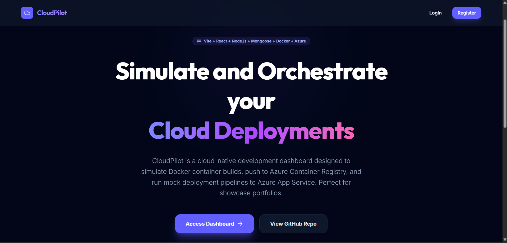

☁️ CloudPilot

A Cloud-Native Project & Deployment Management Dashboard

CloudPilot is a full-stack cloud-native web application that simulates the workflow of a modern deployment platform. It provides developers with a centralized dashboard to manage projects, monitor deployment pipelines, track build history, and visualize cloud deployment workflows.

Unlike traditional CRUD applications, CloudPilot focuses on demonstrating concepts commonly used in cloud engineering and DevOps such as project management, deployment tracking, containerization, authentication, and cloud hosting.

The application is built using the MERN Stack, containerized using Docker, and deployed on AWS EC2, making it suitable for learning cloud deployment workflows and showcasing modern full-stack development skills.

📖 Why CloudPilot?

Modern software development is no longer limited to writing code. Applications must also be deployed, monitored, maintained, and managed in cloud environments.

CloudPilot was created to demonstrate these concepts through an interactive dashboard that simulates a cloud deployment platform.

The application provides users with the ability to:

Manage cloud projects
Track deployment activities
Visualize deployment statistics
Maintain deployment history
Authenticate securely
Experience a cloud-inspired management dashboard

The goal of CloudPilot is to combine modern web development with cloud computing concepts into a single portfolio project.

🚀 Features
User Authentication
User Registration
Secure Login
JWT Authentication
Password Hashing using bcrypt
Protected Routes
Dashboard
Project Statistics
Success Rate Monitoring
Build Statistics
Recent Activities
Live Connection Status
Project Management

Users can

Create Projects
View Active Projects
Manage Existing Projects
Track Repository Information
Deployment Pipeline

CloudPilot simulates a deployment workflow by recording deployment information such as

Build ID
Commit Hash
Deployment Status
Build Duration
Deployment Time
Deployment Logs

This demonstrates how deployment dashboards found in modern cloud platforms display deployment information.

User Profile
Profile Information
Account Details
User Role
Email Information
Modern UI
Dark Theme
Responsive Layout
Modern Dashboard Design
Cloud-inspired Interface
🛠 Technology Stack
Frontend
React
Vite
React Router
Material UI (MUI)
Axios
Backend
Node.js
Express.js
MongoDB Atlas
Mongoose
JWT
bcrypt
DevOps & Cloud
Docker
Docker Compose
Git
GitHub
AWS EC2 (Deployment)
PM2
Nginx
🏗 System Architecture
                     User
                       │
                       ▼
                React Frontend
               (Vite + Material UI)
                       │
                 REST API (Axios)
                       │
                       ▼
              Express.js Backend
                       │
          JWT Authentication Middleware
                       │
                       ▼
                 MongoDB Atlas
                       │
           Project & Deployment Data
                       │
                       ▼
         Dashboard • Projects • History
                       │
                 Docker Container
                       │
                  AWS EC2 Instance
📸 Application Screenshots
🏠 Landing Page

Shows the modern landing page introducing CloudPilot and its cloud-native deployment workflow.

📊 Dashboard

Displays project statistics, build success rate, deployment metrics, and recent activity.

(images/4.png)

📁 Project Management

Allows users to create and manage deployment projects.

(images/2.png)

📜 Deployment History

Shows deployment logs, commit hashes, build duration, and deployment status.

(images/3.png)

👤 User Profile

Displays authenticated user information and account details.

(images/1.png)

🔐 Authentication Workflow
User Login
      │
      ▼
Validate Credentials
      │
      ▼
Generate JWT Token
      │
      ▼
Store Authentication Token
      │
      ▼
Access Protected Routes
📦 Project Structure
CloudPilot

client/
│
├── src/
├── public/
├── components/
├── pages/
└── utils/

server/
│
├── src/
├── routes/
├── controllers/
├── middleware/
├── models/
└── config/

Dockerfile
docker-compose.yml
README.md
⚙ Installation

Clone Repository

git clone https://github.com/ShoneYohannan/Cloudpilot.git

Move into project

cd Cloudpilot
Backend
cd server

npm install

npm run dev
Frontend
cd client

npm install

npm run dev
🔑 Environment Variables

Create a .env file inside the backend directory.

PORT=5000

MONGO_URI=your_mongodb_connection_string

JWT_SECRET=your_secret_key
🐳 Docker

Build Docker Image

docker build -t cloudpilot .

Run Docker Container

docker compose up
☁ AWS Deployment

CloudPilot is designed to be deployed on AWS EC2 using Docker.

Deployment Workflow

GitHub Repository
        │
        ▼
AWS EC2 Instance
        │
Clone Repository
        │
Docker Build
        │
Run Containers
        │
PM2 Process Manager
        │
Nginx Reverse Proxy
        │
Public Website
📈 Future Enhancements
GitHub Actions CI/CD
Kubernetes Deployment
Redis Caching
Docker Swarm Support
Kubernetes Monitoring
Role-Based Access Control (RBAC)
Email Verification
Notifications
Real-Time Deployment Logs
Multi-User Collaboration
Cloud Monitoring Dashboard
Kubernetes Cluster Simulation
👨‍💻 Author

Shone Yohannan

B.Tech – Artificial Intelligence & Data Science

⭐ If you found this project useful, please consider giving it a Star on GitHub.