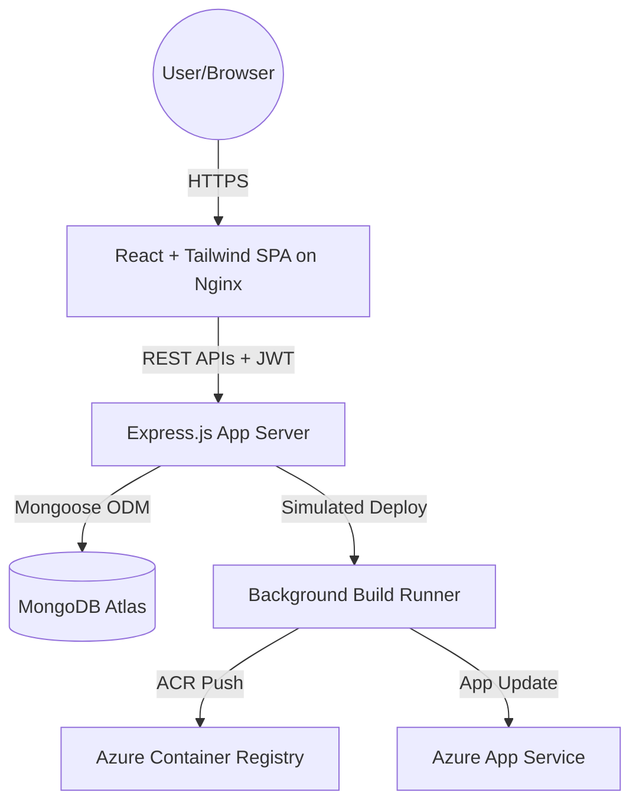

# Technical Architecture Specifications

This document outlines the technical design decisions, database schemas, and directory layout implemented in CloudPilot.

## Architectural Architecture Design

CloudPilot is designed around a decoupled, three-tier architecture:
1. **Presentation Layer**: Built on React (Vite) and Tailwind CSS. Communicates asynchronously with the backend REST endpoints.
2. **Application Layer**: A stateless Express.js REST application. Manages routes, JWT auth interception, validation rules, and deployment simulation workers.
3. **Database Layer**: MongoDB Atlas storing user models, project mappings, build records, and event logs.

---

## Data Model Schemas

### 1. User
- `name`: string (Full user name).
- `email`: string (Validated, unique, lowercase, trimmed).
- `password`: string (Salted bcrypt hash).
- `role`: string (defaults to `"user"`).

### 2. Project
- `name`: string (e.g. Microservice A).
- `description`: string.
- `gitRepository`: string (GitHub URL validation).
- `status`: string (`"active"` or `"inactive"`).
- `user`: ObjectId (References User).

### 3. Deployment
- `project`: ObjectId (References Project).
- `status`: string (`"queued"`, `"in_progress"`, `"success"`, `"failed"`).
- `logs`: array of objects `{ timestamp, message, type }`.
- `duration`: number (Execution run time in seconds).
- `commitHash`: string (Git commit signature).
- `triggeredBy`: ObjectId (References User).

### 4. Activity
- `user`: ObjectId (References User).
- `type`: string (`"project_created"`, etc).
- `description`: string (Custom summary log).
- `metadata`: object containing related model IDs.
